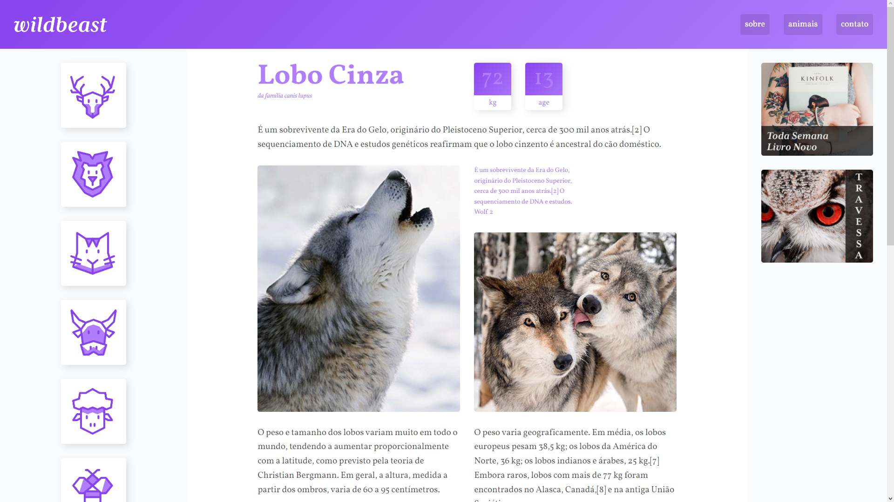

# WILDBEAST

## Tabela de conteúdos

- [Visão Geral](#visão-geral)
  - [Objetivo](#objetivo)
  - [Funcionalidades](#funcionalidades)
  - [Captura de Tela](#captura-de-tela)
  - [Links](#links)
- [O meu processo](#o-meu-processo)
  - [Construído com](#construído-com)
  - [O que aprendi](#o-que-aprendi)
- [Execução do Projeto](#execução-do-projeto)
- [Autor](#autor)

## Visão geral

### Objetivo

Projeto desenvolvido durante o curso de CSS Grid-Layout da plataforma de ensino [Origamid](https://www.origamid.com/curso/css-grid-layout/) 
com o intuito de colocar em prática os conceitos de posicionamento de elementos em uma interface web.

---

### Funcionalidades 

- [x] Responsivo
- [x] Botões animados
- [x] Boas práticas de UI/UX

<br>

### Captura de Tela



<br>

### Links

- URL da solução: [Repositório Github](https://github.com/gustavomarim/projeto-wildbeast)
- Link do Projeto Online: [Github Pages](https://gustavomarim.github.io/projeto-wildbeast/)

<br>

## O meu processo

#### Construído com:

- HTML 5
- CSS 3
- CSS Grid-Layout
- CSS Flexbox

### O que aprendi

Durante o projeto eu pude aprender sobre os conceitos de criação de interface utilizando o Grid CSS e também pude compreender a utilização
de boas práticas de desenvolvimento UI/UX.

## Execução do Projeto

### Pré-requisitos

Antes de começar, você vai precisar ter instalado em sua máquina as seguintes ferramentas:
[Git](https://git-scm.com), [Node.js](https://nodejs.org/en/) e [Live Server](https://marketplace.visualstudio.com/items?itemName=ritwickdey.LiveServer). 
Além disto é bom ter um editor para trabalhar com o código como [VSCode](https://code.visualstudio.com/)

### 🎲 Rodando em localhost

```bash
# Clone este repositório
$ git clone <https://github.com/gustavomarim/projeto-wildbeast.git>

# Acesse a pasta do projeto no terminal/cmd
$ cd projeto-wildbeast

# Execute a aplicação em um servidor HTTP
# No arquivo 'index.html' execute o comando:
$ alt+L alt+O

# O servidor inciará na porta:3000 - acesse <http://localhost:3000>
```

<br>

## Autor

<a href="https://github.com/gustavomarim">
 
 <br />
 <sub><b>Gustavo Dantas</b></sub></a> <a href="https://github.com/gustavomarim" title="GitHub">🚀</a>


Feito com ❤️ por Gustavo Dantas 👋🏽

 [](https://www.linkedin.com/in/gustavodantasmarim/) 


